# System Architecture: ProofOps Agent

## Overview

ProofOps Agent is a Vite and React MVP for the Attio Agentic CRM track. It helps a sales user find consent-aware customer proof for a stalled deal, verify public evidence, generate the next action, and optionally write that action back to Attio.

The current system is a hybrid web app: a React single-page application backed by Vite middleware routes in `server/proofops-api.ts`. It uses fixture Attio-shaped CRM data until live Attio deal and proof asset objects are mapped. External partner services are used at runtime when their keys are configured.

## Key Requirements

- Show a usable proof-matching workflow in the browser.
- Keep API keys and partner credentials server-side.
- Support fixture CRM records for local demo reliability.
- Support live partner integrations for retrieval, evidence, reasoning and voice.
- Keep Attio write-back safe by default with `ATTIO_WRITE_MODE=dry-run`.
- Make data provenance visible: fixture CRM records, live Tavily evidence, live Superlinked reranking, Gemini judgement and SLNG voice.
- Provide webhook-compatible API routes for Attio Workflow or n8n orchestration.
- Avoid silent CRM mutations and duplicate workflow processing.

## High-Level Architecture

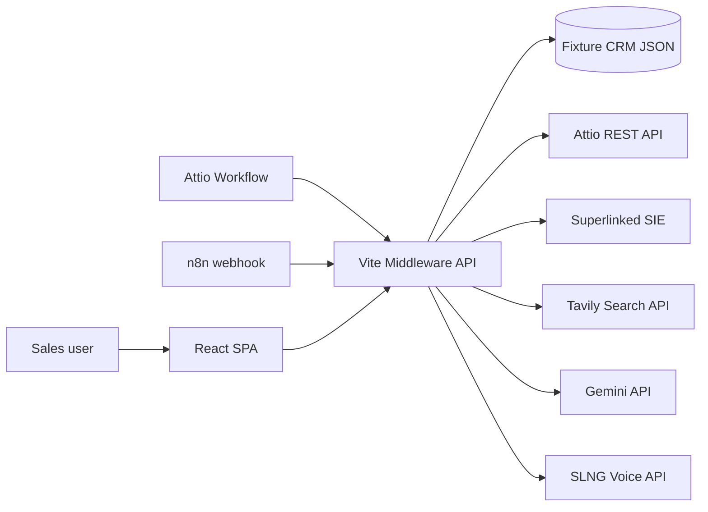

The browser app talks only to local `/api/*` routes. The API layer decides whether to use fixture CRM records or live Attio records, then calls partner services server-side and returns a single `ProofRun` payload to the UI.

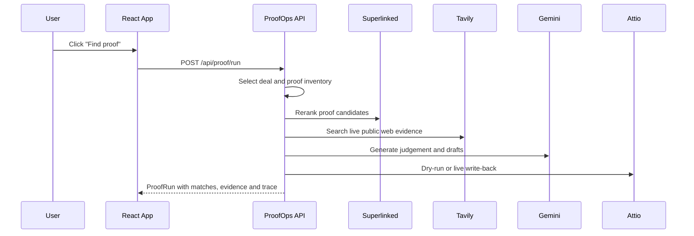

The workflow is deliberately staged. Local scoring provides a deterministic baseline, Superlinked reranks the proof inventory, Tavily adds public evidence, Gemini prepares the narrative judgement, and Attio write-back remains dry-run unless explicitly enabled.

## Diagram Index

- [System context](#system-context)
- [Sponsor placement](#sponsor-placement)
- [End-to-end data flow](#end-to-end-data-flow)
- [Proof run sequence](#proof-run-sequence)
- [Attio or n8n webhook sequence](#attio-or-n8n-webhook-sequence)
- [SLNG voice sequence](#slng-voice-sequence)
- [Deployment architecture](#deployment-architecture)
- [Provider fallback state machine](#provider-fallback-state-machine)
- [Trust boundaries](#trust-boundaries)

## System Context

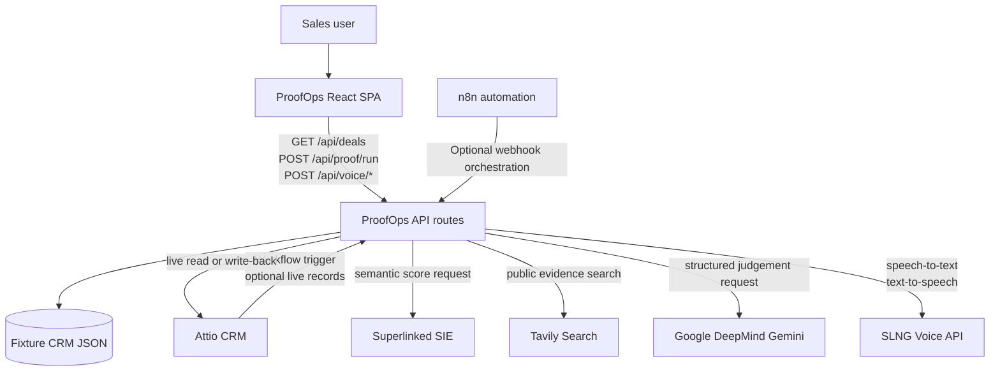

ProofOps has one deliberate trust boundary: the browser never talks to partner APIs directly. All partner credentials stay server-side in Vite middleware locally or in the Vercel serverless function in production.

## Sponsor Placement

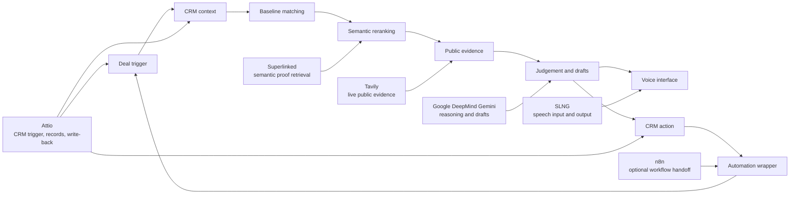

Sponsor usage is not cosmetic. Each partner owns a distinct stage of the agent workflow:

- **Attio:** CRM trigger, deal/proof record model and guarded write-back.
- **Superlinked:** semantic reranking after deterministic local matching.
- **Tavily:** live public evidence search for source-linked proof validation.
- **Google DeepMind / Gemini:** final judgement, risk summary, next action, CRM note and buyer email draft.
- **SLNG:** spoken input and spoken proof summary.
- **n8n:** optional automation boundary around the webhook workflow.

## End-to-End Data Flow

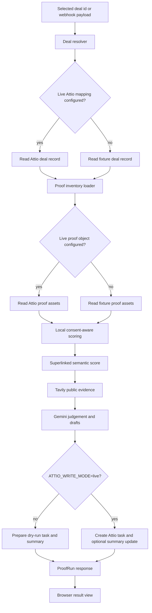

The important data object is `ProofRun`. It carries the selected deal, ranked proof matches, evidence, provider markers, security state, Attio write status and a trace of every step. That makes the demo auditable: judges can see which sponsor services were actually used, skipped or failed.

## Proof Run Sequence

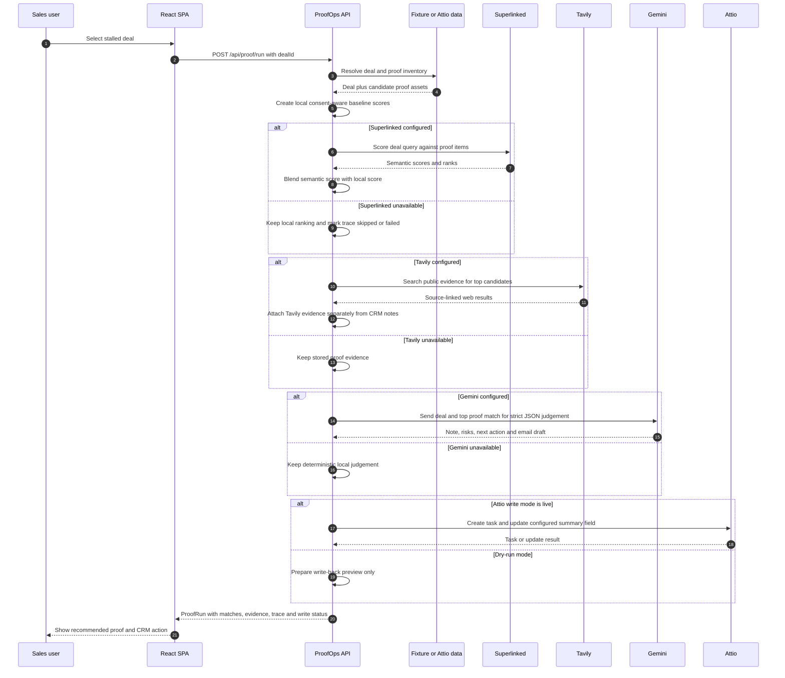

This is the main judging path. The system works without live partner calls, but the strongest demo uses Superlinked, Tavily, Gemini and SLNG keys while keeping Attio mutation in dry-run unless a live CRM write is intended.

## Attio or n8n Webhook Sequence

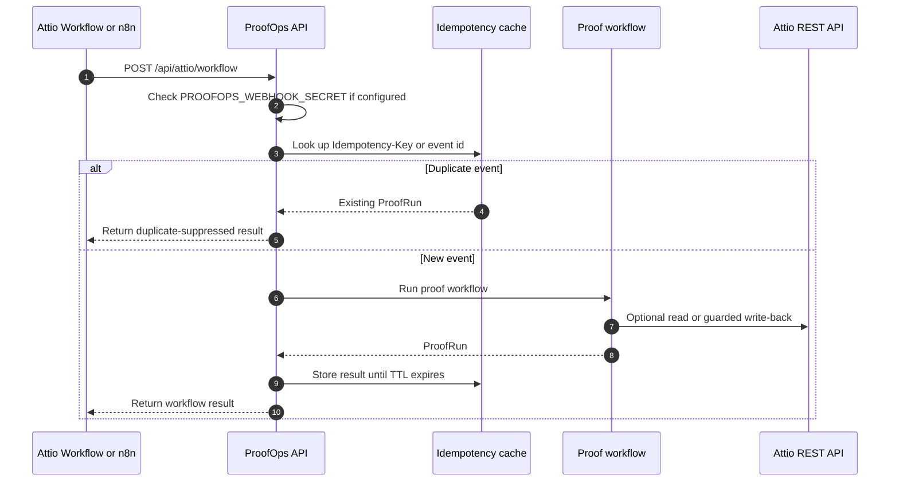

n8n is treated as an orchestration layer, not as the source of truth. It can trigger ProofOps, branch on the result, notify a team, or hand off to another system. Attio remains the CRM action layer.

## SLNG Voice Sequence

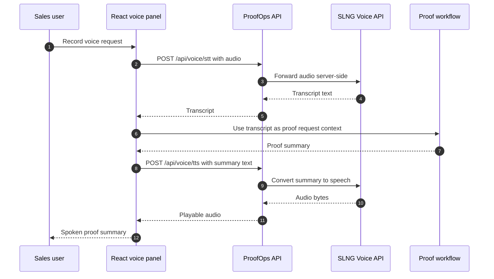

The voice path keeps the SLNG key server-side. The browser only sends recorded audio to ProofOps and receives transcript/audio results back from ProofOps.

## Deployment Architecture

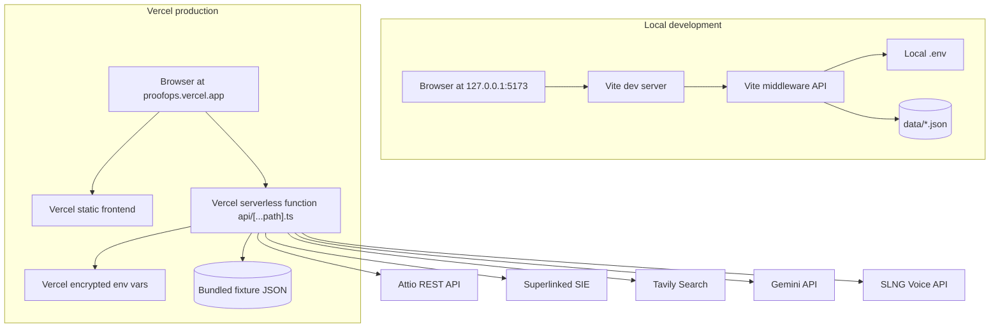

Local development and production use the same handler: `handleProofOpsApi`. Vite mounts it as middleware locally, and Vercel mounts it through `api/[...path].ts`.

## Provider Fallback State Machine

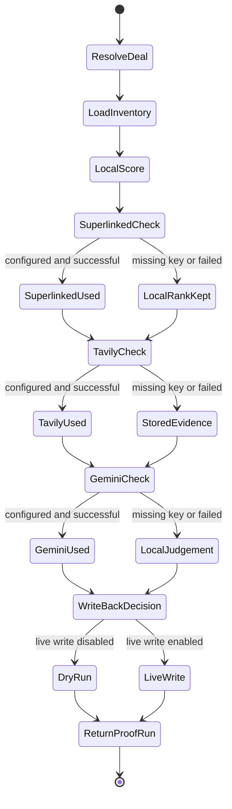

The fallback design is intentional. A sponsor API failure should lower the richness of the result, not break the whole demo.

## Trust Boundaries

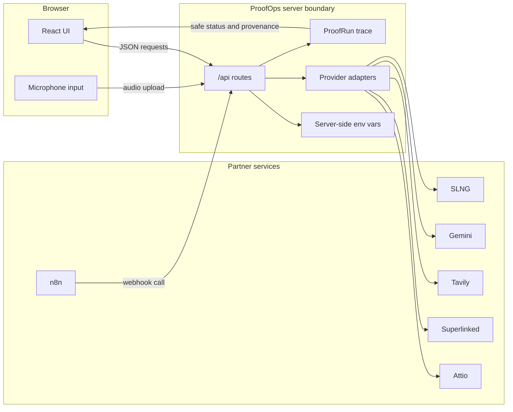

Data sent to external services depends on which keys are configured:

- Attio receives or returns CRM deal, proof asset, task and summary data.
- Superlinked receives deal/proof text used for semantic scoring.
- Tavily receives public-search queries, not API secrets.
- Gemini receives the selected deal and top proof match for structured generation.
- SLNG receives browser audio for transcription or text for speech generation.
- n8n receives only what a configured workflow sends or forwards.

## Component Details

### React App

- **Responsibilities:** Presents the deal list, selected deal, agent workflow, proof matches, evidence, write-back preview, trace and SLNG voice controls.
- **Main technologies:** React 19, TypeScript, Lucide React, CSS in `src/styles.css`.
- **Data owned or transformed:** Holds UI state for selected deal, active tab, current `ProofRun`, voice transcript and transient errors.
- **External dependencies:** Calls local API routes only. It does not call partner APIs directly.
- **Failure modes or operational concerns:** If `/api/proof/run` fails, the UI falls back to embedded deterministic proof matching. Browser microphone access can fail if permissions are denied or `MediaRecorder` is unsupported.

### Vite Middleware API

- **Responsibilities:** Exposes `/api/health`, `/api/deals`, `/api/proof/run`, `/api/attio/workflow`, `/api/voice/stt` and `/api/voice/tts`.
- **Main technologies:** Vite middleware, Node fetch, TypeScript.
- **Data owned or transformed:** Loads fixture JSON, normalises Attio-style records, creates `ProofRun` traces, blends Superlinked scores, adds Tavily evidence and prepares Attio task payloads.
- **External dependencies:** Attio, Superlinked SIE, Tavily, Gemini, SLNG.
- **Failure modes or operational concerns:** Partner APIs can timeout, reject credentials or return partial data. Each partner path is designed to fail back to stored data or local judgement where possible.

### Fixture CRM Data

- **Responsibilities:** Provides deterministic local deals, proof assets and workflow payloads.
- **Main technologies:** JSON files in `data/`.
- **Data owned or transformed:** 12 deal examples, 20 proof asset examples and 8 workflow payload examples.
- **External dependencies:** None.
- **Failure modes or operational concerns:** These are not live customer records. They must not be presented as real CRM data. Public evidence is fetched separately through Tavily.

### Attio Integration

- **Responsibilities:** Reads live deal/proof records when object mappings are configured and writes follow-up tasks or summaries when live write mode is enabled.
- **Main technologies:** Attio REST API v2.
- **Data owned or transformed:** Deal fields, proof asset fields, linked records, tasks and optional proof summary fields.
- **External dependencies:** `ATTIO_API_KEY`, object slugs and attribute mapping environment variables.
- **Failure modes or operational concerns:** The workspace currently needs explicit deal/proof object mapping before live CRM reads are useful. Writes are dry-run by default to avoid unintended CRM mutations.

### Superlinked Integration

- **Responsibilities:** Semantically reranks candidate proof assets for the selected deal.
- **Main technologies:** Superlinked SIE Gateway `/v1/score/{model}`.
- **Data owned or transformed:** Converts the selected deal into a query and proof matches into scored items, then blends semantic relevance with local consent-aware scoring.
- **External dependencies:** `SUPERLINKED_API_KEY`, `SIE_ENDPOINT`, `SUPERLINKED_RERANK_MODEL`.
- **Failure modes or operational concerns:** If SIE is unavailable or the model is not loaded, ProofOps keeps the deterministic local ranking and records the failure in the trace.

### Tavily Integration

- **Responsibilities:** Fetches live public web evidence for top proof candidates.
- **Main technologies:** Tavily Search API.
- **Data owned or transformed:** Builds public evidence queries from deal sector, use case, objections and proof context; returns source-linked evidence with confidence labels.
- **External dependencies:** `TAVILY_API_KEY`, optional project id and search configuration.
- **Failure modes or operational concerns:** Search quality varies by query. Social domains are excluded by default. Tavily evidence is labelled separately from fixture or Attio notes.

### Gemini Integration

- **Responsibilities:** Produces proof judgement, fit rationale, risks, recommended action and email draft.
- **Main technologies:** Google Gemini API.
- **Data owned or transformed:** Receives the selected deal and top proof match. Returns strict JSON that updates the top match narrative fields.
- **External dependencies:** `GOOGLE_API_KEY`, `GEMINI_MODEL`.
- **Failure modes or operational concerns:** If the model call or JSON parsing fails, ProofOps retains deterministic local judgement.

### SLNG Integration

- **Responsibilities:** Provides speech-to-text for voice commands and text-to-speech for spoken proof summaries.
- **Main technologies:** SLNG STT and TTS HTTP endpoints.
- **Data owned or transformed:** Browser audio is proxied server-side to SLNG. Summary text is converted to audio and streamed back to the browser.
- **External dependencies:** `SLNG_API_KEY`, `SLNG_STT_URL`, `SLNG_TTS_URL`.
- **Failure modes or operational concerns:** Microphone permissions are user-controlled. Audio upload size is limited by `SLNG_AUDIO_LIMIT_BYTES`. Generated audio playback can fail in the browser.

### n8n Webhook

- **Responsibilities:** Optional external automation shell for webhook intake, branching and notifications.
- **Main technologies:** Importable workflow in `n8n/proofops-attio-workflow.json`, n8n webhook URL configured through `N8N_WEBHOOK_URL`.
- **Data owned or transformed:** ProofOps does not automatically send CRM data to n8n. n8n can call ProofOps if configured externally.
- **External dependencies:** n8n cloud or self-hosted instance.
- **Failure modes or operational concerns:** Public webhook URLs can transmit data outside the local environment. Use only with deliberate payload design and access controls.

## Data Flow

1. The React app loads deals from `GET /api/deals`.
2. The user selects a deal and starts the workflow.
3. The app calls `POST /api/proof/run` with a `dealId`.
4. The API resolves the deal from inline payload, Attio record id, fixture records or fallback domain data.
5. The API loads proof inventory from Attio if configured, otherwise fixture proof assets.
6. Deterministic local matching creates baseline `ProofMatch` objects.
7. Superlinked reranks candidates when configured.
8. Tavily adds live public web evidence to the top candidates when configured.
9. Gemini updates the top match judgement and drafts when configured.
10. Attio write-back is skipped, dry-run or created depending on credentials and `ATTIO_WRITE_MODE`.
11. The API returns a `ProofRun` containing matches, providers, security state, write status and trace.
12. The UI renders the result and can call SLNG endpoints for voice input/output.

## Data Model

The core domain types live in `src/domain.ts`.

- **Deal:** Company, stage, value, owner, stalled days, segment, use case, objections, risk and next meeting.
- **Customer:** Proof customer profile with sector, segment, champion, consent state, outcomes, products, objections handled, evidence and renewal health.
- **Evidence:** Source title, source label, type, claim, confidence, URL and provider marker (`attio`, `fixture` or `tavily`).
- **ProofAsset:** Summary card generated from a customer proof profile.
- **ProofMatch:** Customer, proof asset, score, consent policy, fit, risks, recommended action, email draft and CRM note.
- **ProofRun:** Full workflow result with deal, matches, provider markers, idempotency key, security flags, Attio write status and trace.

There is no database in the current MVP. Fixture data is read from JSON files. Live CRM persistence is expected to be handled by Attio once object mappings are configured.

## Infrastructure and Deployment

Current infrastructure supports local development and Vercel deployment:

- Vite dev server on `127.0.0.1:5173`.
- Vite middleware serves local API routes in the same process.
- Static production assets are built with `npm run build`.
- Vercel serves the built `dist` frontend and `api/[...path].ts` serverless function.
- `vercel.json` includes `data/**` in the API function bundle for fixture CRM records.
- No CI workflow is configured.

For webhook demos, expose the local Vite server with a tunnel such as:

```bash
ngrok http 5173
```

Production deployment target: Vercel.

## Scalability and Reliability

The MVP is designed for a hackathon demo, not high-volume production traffic.

Current reliability measures:

- Fixture fallback for missing Attio objects.
- Local deterministic matching if Superlinked or Gemini fails.
- Stored evidence fallback if Tavily fails.
- Retry wrapper for transient fetch failures.
- Webhook idempotency cache for duplicate suppression.
- Dry-run default for Attio writes.

Known limitations:

- In-memory idempotency cache is lost when the server restarts.
- No request queue or background worker.
- No persistent database.
- No rate-limit handling beyond provider failures.
- Partner calls run inside the request path, so slow providers can slow the response.

## Security and Compliance

### Secrets Management

Secrets are expected in `.env`, which is ignored by git. `.env.example` lists variable names only. API keys must not be exposed to browser code or committed to the repository.

### Client and Server Trust Boundary

The browser calls only local `/api/*` routes. Partner API calls are made from the Vite middleware API so credentials remain server-side.

### Authentication and Authorisation

The local UI has no user authentication. `/api/attio/workflow` can require `PROOFOPS_WEBHOOK_SECRET` through `x-proofops-secret` or `authorization: Bearer <secret>`.

This is not sufficient for production multi-user access. A production deployment would need user authentication, role checks and stronger webhook verification.

### Sensitive Data Handling

Fixture CRM records are not live customer data. Live Attio data, when configured, should be treated as sensitive CRM data. n8n webhook usage can transmit data to an external service and should be configured deliberately.

### Third-Party Provider Risk

ProofOps can send deal context, proof context, public evidence queries, generated prompts and audio to third-party APIs depending on configured keys. Review provider policies before using real customer data.

### Auditability and Logging

Each `ProofRun` includes a trace showing which providers were used and whether each step completed, skipped or failed. There is no central log store, audit trail or metrics backend yet.

## Observability

Current observability is limited to:

- `/api/health` for configured partners, data sources, fixture counts and write mode.
- Workflow trace in each `ProofRun`.
- Browser-visible trace cards.
- Vite console output during local development.

Missing production observability:

- Structured logs.
- Request IDs across partner calls.
- Metrics and dashboards.
- Error tracking.
- Audit log persistence.

## Design Decisions and Trade-offs

- **Vite middleware instead of a separate backend:** Keeps the hackathon app simple and easy to run locally. The trade-off is that production scaling and API deployment need more work.
- **Fixture CRM data by default:** Makes demos reliable without requiring Attio schema setup. The trade-off is that CRM data is not live until object mappings are configured.
- **Partner integrations behind server routes:** Keeps secrets out of the browser. The trade-off is extra server-side adapter code.
- **Dry-run Attio writes by default:** Reduces risk of accidental CRM mutation. The trade-off is that judges must understand when a write is rehearsed rather than created.
- **Superlinked plus local score blending:** Combines semantic relevance with consent-aware business rules. The trade-off is that score weighting may need tuning against real CRM data.
- **Tavily as public evidence verification:** Separates proof matching from source verification. The trade-off is that live web search can return variable results.
- **Gemini for final judgement:** Produces useful narrative output quickly. The trade-off is reliance on strict JSON output and careful prompt constraints.
- **SLNG voice in the same app:** Makes the demo more interactive. The trade-off is browser permission and audio-device variability.

## Future Improvements

- Create or map live Attio `deals` and `proof_assets` objects.
- Add an Attio schema setup script or documented import path for the 40 fixture examples.
- Add a persistent store for idempotency, audit events and proof run history.
- Add a formal test suite for scoring, consent policy, provider fallback and API routes.
- Add a `tsconfig.json`, `typecheck` script and CI workflow.
- Add production authentication and stronger webhook verification.
- Add structured logging, metrics and request correlation IDs.
- Add screenshots or a short demo recording.
- Add deployment documentation once the production host is chosen.
- Add a licence and maintainer contact details.
