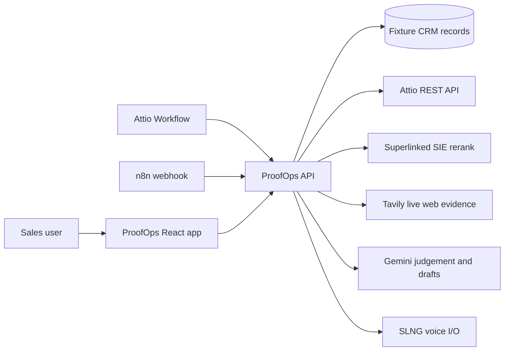

# ProofOps Agent

Consent-aware proof matching for stalled Attio deals.

## Badges


## Description

ProofOps is a hackathon MVP for the Attio Agentic CRM track. It helps a sales team find the right customer proof for a stalled deal, check whether the proof can be shared, verify public evidence, and prepare the next CRM action.

The current project uses fixture Attio-shaped CRM records for deals and proof assets until live Attio object mappings are configured. The partner integrations are real where keys are present: Superlinked reranks proof candidates, Tavily fetches live public web evidence, Gemini generates proof judgement and drafts, and SLNG powers voice input/output.

## Table of Contents

- [Features](#features)
- [Tech Stack](#tech-stack)
- [Architecture Overview](#architecture-overview)
- [Installation](#installation)
- [Usage](#usage)
- [Configuration](#configuration)
- [Screenshots or Demo](#screenshots-or-demo)
- [API Reference](#api-reference)
- [Tests](#tests)
- [Roadmap](#roadmap)
- [Contributing](#contributing)
- [Licence](#licence)
- [Contact or Support](#contact-or-support)

## Features

- Attio-style workflow trigger for stalled deals.
- Consent-aware proof matching with approved, pending, restricted and expired states.
- Superlinked SIE semantic reranking across proof candidates.
- Tavily live web evidence search with source links and confidence labels.
- Gemini-generated proof judgement, notes, risks, next action and email draft.
- SLNG voice command recording and spoken proof summaries.
- n8n webhook configuration for optional external orchestration.
- Safe Attio write-back mode: CRM mutations stay disabled unless `ATTIO_WRITE_MODE=live`.
- Fixture dataset with 12 deals, 20 proof assets and 8 workflow payload examples.

## Tech Stack

- React 19
- TypeScript 5
- Vite 7
- Vite middleware API in `server/proofops-api.ts`
- Lucide React icons
- Node.js verified locally with `v24.14.0`
- npm verified locally with `11.9.0`

Partner services:

- Attio REST API
- Superlinked SIE Gateway
- Tavily Search API
- Google Gemini API
- SLNG speech-to-text and text-to-speech
- n8n webhook automation

## Architecture Overview



The React app calls local API routes exposed by Vite middleware. The API reads fixture or Attio CRM data, reranks proof candidates with Superlinked, enriches them with live Tavily web evidence, asks Gemini for the final judgement, and keeps Attio write-back in dry-run mode unless live mutation is explicitly enabled.

## Installation

Clone the repository and install dependencies:

```bash
git clone https://github.com/MasteraSnackin/ProofOps-Agent.git
cd ProofOps-Agent
npm install
```

Create local environment configuration:

```bash
cp .env.example .env
```

Fill only the keys you want to test. Keep `.env` private; it is intentionally ignored by git.

## Usage

Start the local app:

```bash
npm run dev
```

Open:

```text
http://127.0.0.1:5173/
```

Build the app:

```bash
npm run build
```

Preview a production build:

```bash
npm run preview
```

Run a proof match directly:

```bash
curl -X POST http://127.0.0.1:5173/api/proof/run \
  -H "content-type: application/json" \
  --data '{"dealId":"deal-1"}'
```

## Configuration

Environment variables are listed in [.env.example](.env.example). The most important groups are:

| Variable | Purpose |
| --- | --- |
| `ATTIO_API_KEY` | Attio API token. Required for live Attio reads or writes. |
| `ATTIO_WRITE_MODE` | Keep as `dry-run` unless live CRM mutation is intended. |
| `ATTIO_DEAL_OBJECT` | Attio object slug for live deal records. |
| `ATTIO_PROOF_OBJECT` | Attio object slug for live proof asset records. |
| `TAVILY_API_KEY` | Enables live public web evidence search. |
| `TAVILY_SEARCH_DEPTH` | Tavily search depth, default `advanced`. |
| `TAVILY_MAX_RESULTS` | Result count per Tavily search, default `4`. |
| `TAVILY_EXCLUDE_DOMAINS` | Comma-separated domains excluded from evidence search. |
| `GOOGLE_API_KEY` | Enables Gemini reasoning and draft generation. |
| `GEMINI_MODEL` | Gemini model, default `gemini-2.5-flash`. |
| `SUPERLINKED_API_KEY` | Enables Superlinked SIE reranking. |
| `SIE_ENDPOINT` | Superlinked SIE Gateway endpoint. |
| `SUPERLINKED_RERANK_MODEL` | Reranker model, default `Qwen/Qwen3-Reranker-0.6B`. |
| `SLNG_API_KEY` | Enables SLNG speech-to-text and text-to-speech. |
| `SLNG_TTS_URL` | SLNG TTS endpoint. |
| `SLNG_STT_URL` | SLNG STT endpoint. |
| `N8N_WEBHOOK_URL` | Optional n8n webhook endpoint for orchestration. |
| `PROOFOPS_WEBHOOK_SECRET` | Optional shared secret for `/api/attio/workflow`. |

Current data-source behaviour:

- Deals: fixture CRM records unless `ATTIO_DEAL_OBJECT` maps to a live Attio object.
- Proof assets: fixture CRM records unless `ATTIO_PROOF_OBJECT` maps to a live Attio object.
- Public evidence: live Tavily web search when `TAVILY_API_KEY` is configured.
- Retrieval: live Superlinked SIE when `SUPERLINKED_API_KEY` and `SIE_ENDPOINT` are configured.
- Attio writes: dry-run unless `ATTIO_WRITE_MODE=live`.

## Screenshots or Demo

No screenshots are committed yet.

Local demo path:

1. Start the app with `npm run dev`.
2. Select a stalled deal.
3. Click `Find proof for this deal`.
4. Review matched proof, consent status, live Tavily sources, Attio write preview and trace.
5. Use `Record` or `Listen` in the SLNG voice panel if microphone and audio playback are available.

For a public n8n or Attio webhook demo, expose the local app first:

```bash
ngrok http 5173
```

Then point n8n or Attio Workflow to the tunnel URL.

## API Reference

| Method | Route | Description |
| --- | --- | --- |
| `GET` | `/api/health` | Returns configured partners, data sources, fixture counts and write mode. |
| `GET` | `/api/deals` | Returns fixture-backed or mapped Attio deal records. |
| `POST` | `/api/proof/run` | Runs the full proof matching workflow. |
| `POST` | `/api/attio/workflow` | Webhook-compatible proof workflow entry point. |
| `POST` | `/api/voice/stt` | Forwards browser audio to SLNG speech-to-text. |
| `POST` | `/api/voice/tts` | Returns SLNG speech audio for a proof summary. |

Example `/api/proof/run` body:

```json
{
  "dealId": "deal-1"
}
```

Example Attio/n8n webhook body:

```json
{
  "dealId": "attio-record-id",
  "source": "attio-workflow"
}
```

When `PROOFOPS_WEBHOOK_SECRET` is set, `/api/attio/workflow` requires one of:

```http
x-proofops-secret: your-shared-secret
authorization: Bearer your-shared-secret
```

Repeated workflow calls are deduplicated with `Idempotency-Key` or the Attio deal/event id.

## Tests

There is no dedicated automated test suite yet.

Current verification commands:

```bash
npm run build
```

```bash
npm exec tsc -- --noEmit --skipLibCheck \
  --jsx react-jsx \
  --module ESNext \
  --moduleResolution Bundler \
  --target ES2022 \
  --lib ES2022,DOM \
  --allowSyntheticDefaultImports \
  src/main.tsx src/domain.ts server/proofops-api.ts vite.config.ts
```

Recommended next test work:

- Add a `tsconfig.json` and a `typecheck` npm script.
- Add unit tests for proof scoring, consent policy and Superlinked score blending.
- Add API tests for `/api/proof/run`, `/api/health` and webhook idempotency.
- Add browser tests for the main workflow and Evidence tab labels.

## Roadmap

- Map live Attio `deals` and `proof_assets` objects.
- Seed or create the Attio proof asset schema.
- Add safe live write-back for tasks and `proofops_summary`.
- Add a proper test suite and CI workflow.
- Add screenshots or a short demo recording.
- Add deployment instructions once a production host is chosen.
- Decide whether reference requests are handled by Attio tasks, n8n, email tooling or a dedicated workflow.

## Contributing

Contributions are welcome once repository guidelines are added.

Suggested workflow:

1. Create a feature branch.
2. Keep secrets out of git.
3. Run the build and type-check commands.
4. Document any new environment variables.
5. Open a pull request with a short description and verification notes.

## Licence

`<ADD LICENSE>`

No licence file is currently present in this repository.

## Contact or Support

`<ADD CONTACT OR SUPPORT CHANNEL>`

For hackathon judging, start with the local demo at `http://127.0.0.1:5173/` and review `/api/health` to confirm which integrations are active.
