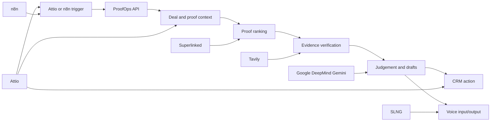
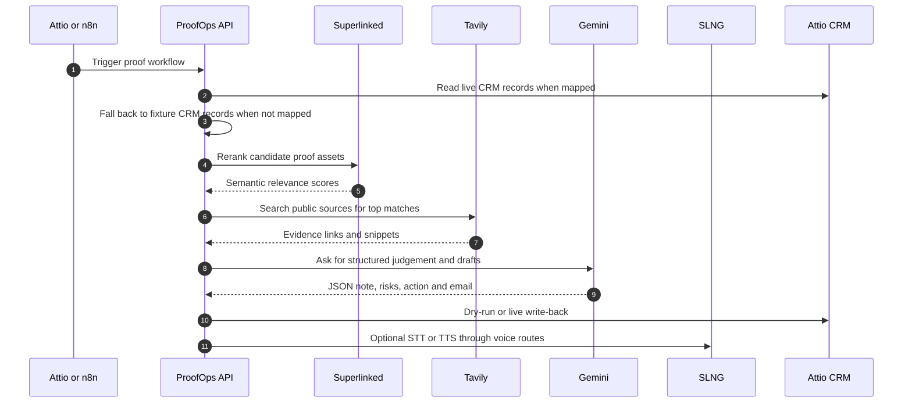

# Partner and Sponsor Usage

ProofOps uses the hackathon partner technologies as a sales proof agent for stalled Attio deals. The core demo path is: read CRM context, rank relevant proof, verify public evidence, generate the next action, and provide voice input/output.

## Technologies Used

| Partner | Status in ProofOps | Why it is used |
| --- | --- | --- |
| Google DeepMind / Gemini | Used directly in the proof run | Generates the final structured judgement: proof fit, risks, recommended next action, CRM note and buyer email draft. In code this is implemented through the Gemini API using `GOOGLE_API_KEY` and `GEMINI_MODEL`. |
| Attio | Core CRM entry point and write-back target | Provides the Agentic CRM context. ProofOps is built around stalled Attio deals, Attio-style workflow payloads, optional live Attio reads, dry-run write-back previews, and live task/summary write-back when explicitly enabled. |
| SLNG | Side Challenge, used directly in the UI | Adds voice input and voice output. Sales users can speak a proof request and listen to a generated proof summary, with audio proxied through server-side `/api/voice/stt` and `/api/voice/tts` routes. |
| Superlinked | Side Challenge, used directly in retrieval | Reranks proof candidates semantically against the stalled deal. Local matching creates a deterministic baseline, then Superlinked improves relevance using sector, segment, objections, products, consent and outcome signals. |
| n8n | Side Challenge, workflow integration point | Provides the automation handoff layer. ProofOps exposes a webhook-compatible `/api/attio/workflow` route and keeps `N8N_WEBHOOK_URL` available for orchestration demos where n8n receives or triggers the proof workflow. |
| Tavily | Used directly for live public evidence | Finds current public sources that support or qualify a proof match. Tavily evidence is labelled separately from CRM notes so the demo can show provenance instead of blending internal claims with public verification. |

## Sponsor Architecture

## Sponsor Data Flow

## What Judges Can See

| Partner | Visible proof in the demo |
| --- | --- |
| Attio | The UI starts from a stalled deal, shows Attio-style trigger context and displays the write-back preview or live write status. `/api/health` reports whether Attio credentials are configured. |
| Superlinked | The workflow trace shows whether Superlinked semantic retrieval completed, failed or was skipped. Matches include semantic ranking notes when Superlinked is used. |
| Tavily | Evidence cards show source-linked public evidence and label it as Tavily live web evidence. |
| Google DeepMind / Gemini | The top proof match contains Gemini-enhanced judgement, risk handling, recommended action, CRM note and email draft when configured. |
| SLNG | The voice panel supports recording a spoken request and playing a spoken proof summary through `/api/voice/stt` and `/api/voice/tts`. |
| n8n | The webhook-compatible `/api/attio/workflow` route supports automation handoff with idempotency and optional shared-secret verification. |

## Implementation Map

| Partner | Main files or routes |
| --- | --- |
| Attio | `server/proofops-api.ts`, `/api/proof/run`, `/api/attio/workflow`, Attio write-back helpers |
| Superlinked | `server/proofops-api.ts`, `rerankWithSuperlinked`, `SUPERLINKED_API_KEY`, `SIE_ENDPOINT` |
| Tavily | `server/proofops-api.ts`, `enrichWithTavily`, `TAVILY_API_KEY` |
| Google DeepMind / Gemini | `server/proofops-api.ts`, `rankWithGemini`, `GOOGLE_API_KEY`, `GEMINI_MODEL` |
| SLNG | `src/main.tsx`, `server/proofops-api.ts`, `/api/voice/stt`, `/api/voice/tts` |
| n8n | `/api/attio/workflow`, `N8N_WEBHOOK_URL`, idempotency and webhook-secret handling |

## Challenge Coverage

| Challenge or Track | How ProofOps qualifies |
| --- | --- |
| Attio Agentic CRM Track | The product is centred on Attio: it accepts Attio workflow-style triggers, models Attio deal/proof records, prepares CRM notes, and supports guarded write-back. |
| SLNG Side Challenge | Voice input/output is part of the user interface and is wired through server-side STT/TTS endpoints. |
| Superlinked Side Challenge | Superlinked is used for semantic proof retrieval and score blending, not just listed as a dependency. |
| n8n Side Challenge | ProofOps has a webhook-compatible automation boundary for n8n orchestration and idempotent workflow handling. |
| Tavily Partner Usage | Tavily powers live web evidence search for proof verification. |
| Google DeepMind Partner Usage | Gemini is used for reasoning and draft generation after evidence and retrieval steps have completed. |

## Demo Narrative

1. An Attio deal stalls because the buyer asks for proof.
2. ProofOps reads the deal context and candidate proof assets.
3. Superlinked semantically reranks proof candidates.
4. Tavily checks live public evidence for the strongest matches.
5. Gemini produces the judgement, risks, next action, note and email draft.
6. SLNG lets the user speak the request or listen to the output.
7. Attio write-back stays in dry-run mode by default, with optional live write-back when configured.
8. n8n can sit around the workflow as an automation trigger or handoff layer.

## Safety Notes

- Partner API keys are server-side only.
- The browser calls only local `/api/*` routes.
- Attio write-back is dry-run unless `ATTIO_WRITE_MODE=live`.
- Fixture CRM records are demo data, not live customer data.
- Tavily evidence is shown as public web evidence, separate from CRM proof notes.
