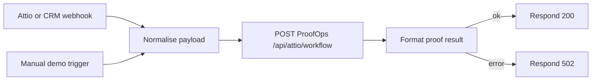

# n8n Workflow: ProofOps Attio Handoff

The importable n8n workflow is here:

[n8n/proofops-attio-workflow.json](../n8n/proofops-attio-workflow.json)

I could not connect directly through an n8n MCP connector from this Codex session because no n8n MCP tool or installable n8n connector was available. The workflow has still been built as a real n8n import file.

## What It Does



The workflow accepts either:

- a webhook event from Attio, another CRM, or another automation, or
- a manual demo run inside n8n.

It then calls:

```text
https://proofops.vercel.app/api/attio/workflow
```

ProofOps keeps the sponsor integrations server-side. n8n does not receive Attio, Superlinked, Tavily, Gemini or SLNG API keys.

## Nodes

| Node | Purpose |
| --- | --- |
| `Manual Demo Trigger` | Lets you test the workflow from inside n8n without waiting for an external CRM event. |
| `Build Manual Demo Payload` | Creates a Camden Integrated Care Board demo payload. |
| `Attio or CRM Webhook` | Exposes a `POST` webhook path named `salesforce-webhook`. |
| `Normalise ProofOps Payload` | Extracts `dealId`, event id and idempotency key from the incoming payload. |
| `Call ProofOps Agent` | Sends the normalised event to ProofOps. |
| `Format ProofOps Result` | Reduces the full `ProofRun` into a judging-friendly response summary. |
| `ProofOps OK?` | Branches success and failure responses. |
| `Respond Success` | Returns HTTP 200 with the proof summary. |
| `Respond Failure` | Returns HTTP 502 with the ProofOps error summary. |

## Import Into n8n

1. Open n8n.
2. Go to `Workflows`.
3. Choose `Import from File`.
4. Select [n8n/proofops-attio-workflow.json](../n8n/proofops-attio-workflow.json).
5. Save the workflow.
6. Run `Manual Demo Trigger` once to confirm the ProofOps call works.
7. Activate the workflow when ready.

After activation, the production webhook URL will follow this shape:

```text
https://<your-n8n-domain>/webhook/salesforce-webhook
```

The n8n test URL usually follows this shape while the workflow is open in test mode:

```text
https://<your-n8n-domain>/webhook-test/salesforce-webhook
```

## Expected Webhook Payload

Minimal payload:

```json
{
  "dealId": "deal-001",
  "source": "n8n-attio-workflow",
  "trigger": "deal_stalled"
}
```

Attio-style payload:

```json
{
  "dealId": "deal-001",
  "trigger": "deal_stalled",
  "events": [
    {
      "event_id": "evt_camden_stalled_001",
      "type": "record.updated",
      "id": {
        "workspace_id": "wrk_demo",
        "object_id": "obj_deals",
        "record_id": "deal-001"
      }
    }
  ]
}
```

The workflow sends the event id as the `idempotency-key` header to ProofOps. That lets ProofOps suppress duplicate webhook deliveries.

## Optional Webhook Secret

The deployed ProofOps webhook is currently open according to `/api/health`, so the workflow works without a shared secret.

If you later set `PROOFOPS_WEBHOOK_SECRET` on the ProofOps deployment, update the `Normalise ProofOps Payload` node so `proofopsSecret` is set from a secure n8n variable or credential. The HTTP node already forwards it as:

```text
x-proofops-secret
```

Do not commit the real value to git.

## Test With curl

Replace `<your-n8n-domain>` with the n8n Cloud domain after importing the workflow:

```bash
curl -X POST "https://<your-n8n-domain>/webhook-test/salesforce-webhook" \
  -H "content-type: application/json" \
  -d '{
    "dealId": "deal-001",
    "source": "n8n-curl-test",
    "trigger": "manual_demo_run"
  }'
```

Expected response shape:

```json
{
  "ok": true,
  "statusCode": 200,
  "deal": "Camden Integrated Care Board",
  "bestMatch": "Northstar Health Trust",
  "consent": "approved",
  "retrievalProvider": "superlinked",
  "evidenceProvider": "tavily",
  "reasoningProvider": "gemini",
  "attioWriteStatus": "dry-run",
  "duplicateSuppressed": false
}
```

## Verification Already Run

The workflow file parses as valid JSON.

A direct smoke test against production ProofOps returned:

```json
{
  "deal": "Camden Integrated Care Board",
  "bestMatch": "Northstar Health Trust",
  "retrievalProvider": "superlinked",
  "evidenceProvider": "tavily",
  "reasoningProvider": "gemini",
  "attioWriteStatus": "dry-run",
  "duplicateSuppressed": false
}
```
